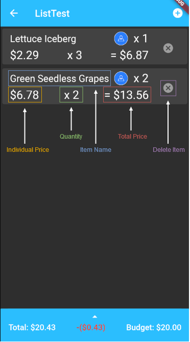
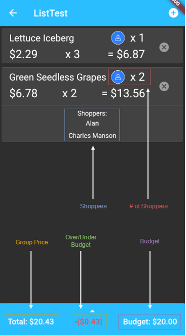

SocialShopper
======
### Installation

1.  Set up your environment: https://flutter.dev/docs/get-started/install
2.  Clone this repository: https://github.com/Peroshki/CSE115.git
3.  Open the application folder in your IDE of choice and run it using the Android Emulator.

### Getting Started

Once you have successfully launched the app, you will be brought to the login screen.

If you have already created an account with SocialShopper, enter your email and password and press `Log In`.

If you have not yet created an account with SocialShopper, press `Sign Up` to set up an account. Optionally, you may press `Sign in with Google` to log in to SocialShopper with a Google account.

### Shopping Lists

#### Navigating the List View:

 

Once you have finished shopping, press the up arrow on the bottom bar to display the group and individual totals. Then, press `Pay Now` to navigate to the payment screen.

#### Adding Items:

In order to add an item to a list, navigate to the list's view and press the `+` at the top right-hand corner of the screen. This will bring you to the item selection screen.

Select an item from the list and enter the desired quantity, then double tap the item name to bring up the names of the shoppers on your list. Indicate which shoppers want the selected item using the checkboxes and press `done` to add the item to your shopping list.

If an item you are looking for is not available, navigate to the `Custom` tab in the item selection screen. Enter the item's name, price, quantity, and the shoppers interested in this item. Finally, press `Save` to add the item to your shopping list.

## Coming Soon
- Facebook/Twitter integration
- Mobile payments
